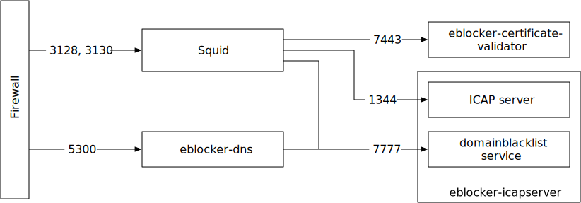
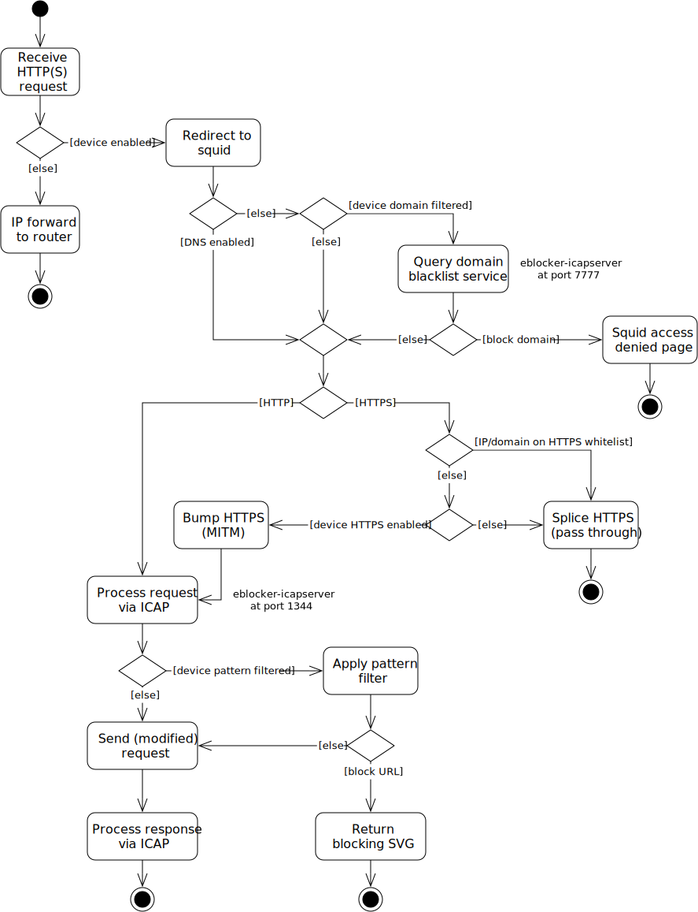
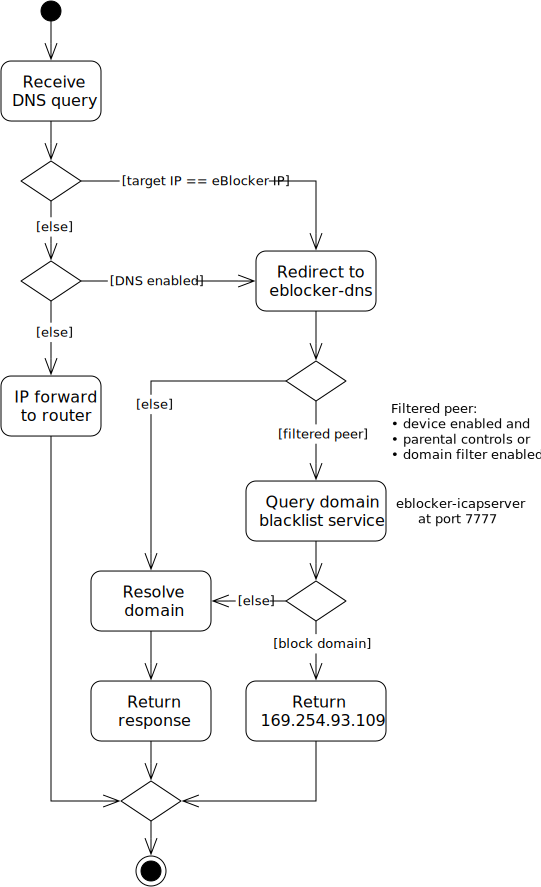

# Filtering

## Filter Components

The following diagram shows the network connections and ports used
between the components.

## HTTP Filter

This diagram shows how the firewall, squid and ICAP server interact for filtering URLs.

## DNS Filter

This diagram shows how the firewall, DNS server and ICAP server interact for filtering domains.

## Filter Lists

Filter lists are updated by the package [eblocker-lists](https://github.com/eblocker/eblocker-lists).
