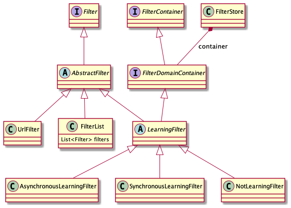

# Pattern Blocker

Requests that eBlocker receives via ICAP are processed by the pattern
blocker. It has access to the full URLs.

Pattern filters are defined in the [EasyList format](https://help.adblockplus.org/adblock-plus-help-center/how-to-write-filters).

Each filter rule is
[parsed](/apidocs/eblocker-icapserver/org/eblocker/server/icap/filter/easylist/EasyListLineParser.html)
and a
[UrlFilter](/apidocs/eblocker-icapserver/org/eblocker/server/icap/filter/url/UrlFilter.html)
is created from it.

## Filter Manager

Filter lists are organized in
[categories](/apidocs/eblocker-icapserver/org/eblocker/server/icap/filter/Category.html),
e.g. ads, trackers, malware. The built-in filter lists are defined in
[patternfilters.json](https://github.com/eblocker/eblocker/blob/develop/eblocker-icapserver/src/main/resources/patternfilters.json). Each
object in this file is a
[FilterStoreConfiguration](/apidocs/eblocker-icapserver/org/eblocker/server/icap/filter/FilterStoreConfiguration.html)
that is saved in Redis.

The
[FilterManager](/apidocs/eblocker-icapserver/org/eblocker/server/icap/filter/FilterManager.html)
creates `FilterStore` objects from the configurations and caches them
in encrypted JSON files at `/opt/eblocker-icap/conf/filter/`.

## Filter Store

The
[FilterStore](/apidocs/eblocker-icapserver/org/eblocker/server/icap/filter/FilterStore.html)
maps domains to the rules that have matched on their URLs. Since there
are tens of thousands of rules, it is not feasible on a Raspberry Pi
to check every rule for every request.

## Learning Filters

A
[LearningFilter](/apidocs/eblocker-icapserver/org/eblocker/server/icap/filter/learning/LearningFilter.html)
learns the mapping from a domain to the rules its URLs have matched
on.

There are two main learning filters:

* [SynchronousLearningFilter](/apidocs/eblocker-icapserver/org/eblocker/server/icap/filter/learning/SynchronousLearningFilter.html) learns the mapping during filtering.
* [AsynchronousLearningFilter](/apidocs/eblocker-icapserver/org/eblocker/server/icap/filter/learning/AsynchronousLearningFilter.html)
  learns the mapping after filtering, i.e. the first result of the
  filter is NO_DECISION.

For performance reasons the `AsynchronousLearningFilter` should be used for large filter lists.

## Filter List

Filters for a specific domain (or the wildcard domain `*.*`) are
stored in a filter store as a
[FilterList](/apidocs/eblocker-icapserver/org/eblocker/server/icap/filter/FilterList.html). The
filters are sorted by
[priority](/apidocs/eblocker-icapserver/org/eblocker/server/icap/filter/FilterPriority.html)
in the list.

## Filter Classes

## HTTP Response

If the pattern blocker blocks a URL, it usually returns an SVG image
containing a transparent pixel.

To avoid the problem of an empty browser window an onload handler
checks whether the SVG is loaded as the top document. In this case the
browser is redirected to an eBlocker blocking page.

For some specific URLs [surrogate
scripts](https://github.com/eblocker/eblocker/tree/develop/eblocker-icapserver/src/main/resources/surrogates)
are returned instead of the SVG image.
