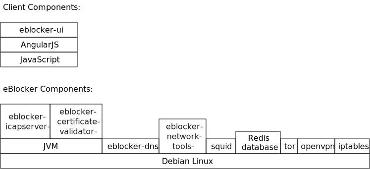

# eBlocker Developer Documentation

## Main Components

[User interface](ui.html)

[ICAP server](icapserver)

[DNS server](https://github.com/eblocker/eblocker-coredns)

[Squid proxy](https://github.com/eblocker/eblocker-squid)

[Certificate validator](CertificateValidator.html)

[Database](db.html)

## Concepts

[Filtering](filters.html)

[Configuration](configuration.html)

[Building](BuildPackages.html)

## Overview

## System Architecture

More details can be found in the presentation [Technical Background
and Core Architecture](eBlocker_Open_Source_System_Architecture.pdf).
